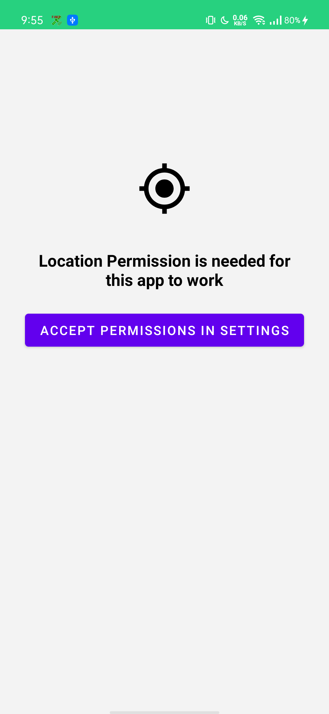

A            |  A
:-------------------------:|:-------------------------:
  |  
  |  
  |  

### [Download APK](https://drive.google.com/file/d/1I6MMBrUmwhG-avq5Km_WfQWnGaZdz5pD/view?usp=sharing)

#### Task Features
- implementation of a small app using the Foursquare Places API that shows a list of venues around the user’s location.
- permissions handling
- live tracking user location only when the user uses the app on specific screen.
- Unit Testing using [mockK](https://mockk.io/), [Kotest](https://github.com/kotest/kotest), [turbine](https://github.com/cashapp/turbine)
- Ui Testing using [Kaspresso](https://github.com/KasperskyLab/Kaspresso)

#### [Structure is Based on my own structure here](https://github.com/EsmaeelNabil/refresh-starter-template/tree/hilt)

### Structure Features
* [Hiding secretKeys in properties Files using gradle secrets](https://github.com/google/secrets-gradle-plugin)
* [Dependencies Versions & update plugin](https://jmfayard.github.io/refreshVersions/)
* [Dagger-Hilt](https://dagger.dev/hilt/gradle-setup)
* [Usecases Approach](https://proandroiddev.com/why-you-need-use-cases-interactors-142e8a6fe576)
* [Dependency inversion](https://medium.com/@kedren.villena/simplifying-dependency-inversion-principle-dip-59228122649a)
 and [SOLID](https://medium.com/backticks-tildes/the-s-o-l-i-d-principles-in-pictures-b34ce2f1e898) 


---
###### to add new `Dependencies` you have two methods :
- do it like this [Video](https://youtu.be/VhYERonB8co)
- or add the dependency in `buildSrc/Libs` like this
```const val security_crypto: String = "androidx.security:security-crypto:_"```
- then add it in `build.gradle.kts` of the app  like this
```implementation(Libs.State.appState)```
###### to get latest `Dependencies` versions run this gradle command :
```
./gradlew refreshVersions
```
##### latest versions will be in [versions.properties]() to select from.

###### `TO ADD NEW SECRETS ` put them in `secrets.properties` file that is located in `ROOT` project folder

``` json
token_header_name="Authorization"
base_url="https://api.github.com/"
```


